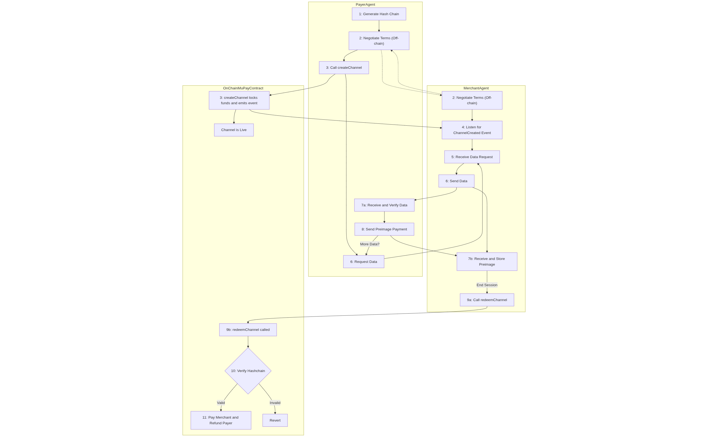

# Micropay Agents

Micropay-Agents is a TypeScript-based framework enabling off-chain micropayment channels between a client agent and a merchant agent, secured by smart contracts on Ethereum. It demonstrates atomic, trustless payment-for-data using hashchain commitments and Hashchain Protocol contract integration. This architecture enables a true pay-as-you-go model, where users pay incrementally for each data unit or API call as it is consumed.

The system utilizes the [Hashchain Protocol](https://hashchainprotocol.com) in the backend, providing a cryptographically secure and efficient way to manage conditional payments and prevent fraud. Each payment is validated by revealing the next preimage in a cryptographic hashchain, ensuring that only valid, sequential payments are accepted by the merchant. This protocol underpins reliable and trustless micropayment flows, making Micropay-Agents suitable for usage-based billing, paid APIs, IoT data monetization, and other granular payment scenarios.

This architecture enables a true pay-as-you-go model, where users or autonomous AI agents pay incrementally for each data unit or API call as consumed.

## Use Case

Micropay-Agents is perfect for granular, on-demand scenarios such as:
- Pay-per-query DeFi dashboards or data analytic APIs.
- Pay-as-you-go access to Web3 account intelligence, oracle feeds, or other metered services.
- AI agents or IoT devices making autonomous, trackable data purchases in programmable economic flows.

A concrete example now implemented is the integration with the **1inch Portfolio API**, which enables users to pay incrementally for real-time, on-demand DeFi portfolio data fetched for arbitrary Ethereum addresses. With the integration of the 1inch Portfolio API, users can access detailed DeFi portfolio data for any Ethereum address, paying incrementally for each request through **secure, gasless, off-chain hashchain micropayments**. This implementation demonstrates a practical use of pay-as-you-go DeFi data APIs, as envisioned by the ETHGlobal Unite DeFi Hackathon.

## Architecture Diagram

## Key Features

### Merchant Agent

- Provides API to negotiate channels, serve data, receive micropayments, and redeem channels.
- Listens for on-chain `ChannelCreated` events for channel tracking.
- Verifies hashchain payment tokens in-memory for security.
- Executes on-chain channel redemption with MuPay smart contract.

### Client Agent

- Negotiates payment channel terms via HTTP with the merchant.
- Generates cryptographic hashchains per the Hashchain Protocol to secure micropayments.
- Creates payment channels and manages token payments on-chain.
- Sends sequential payment tokens ("preimages") corresponding to actual consumption.

### Technology Stack

TypeScript, Express.js, ethers.js, dotenv, Hashchain Protocol (sdk and smart contract).